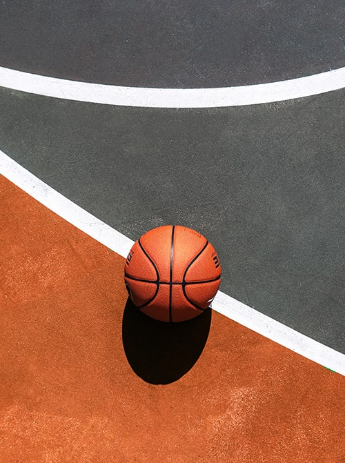
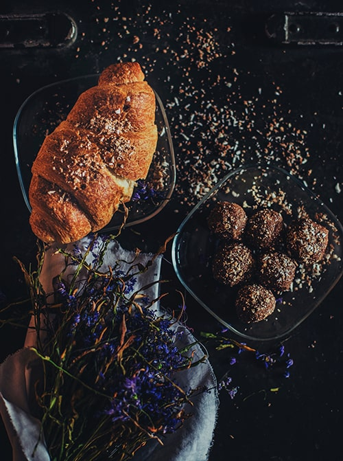

            

              <!-- Customize Button-->
              

                <button class="btn dropdown-toggle" type="button" data-toggle="dropdown" aria-haspopup="true"
                  aria-expanded="false"><i class="lni lni-more"></i></button>
                

                  <button class="dropdown-item" type="button"><i class="mr-1 lni lni-cut"></i>Remove</button>
                  <button class="dropdown-item" type="button"><i class="mr-1 lni lni-crop"></i>Edit</button>
                  <button class="dropdown-item" type="button"><i class="mr-1 lni lni-cog"></i>Settings</button>
                

              

              

              
<a class="post-catagory" href="#">Sports</a><a class="post-title"
                  href="single.html">WBL was held in June 2020</a>

            

          

            

              
<i class="lni lni-play"></i>

              <!-- Customize Button-->
              

                <button class="btn dropdown-toggle" type="button" data-toggle="dropdown" aria-haspopup="true"
                  aria-expanded="false"><i class="lni lni-more"></i></button>
                

                  <button class="dropdown-item" type="button"><i class="mr-1 lni lni-cut"></i>Remove</button>
                  <button class="dropdown-item" type="button"><i class="mr-1 lni lni-crop"></i>Edit</button>
                  <button class="dropdown-item" type="button"><i class="mr-1 lni lni-cog"></i>Settings</button>
                

              

              

              
<a class="post-catagory" href="#">Lifestyle</a><a class="post-title"
                  href="single.html">Make yummy toast in home</a>

            

